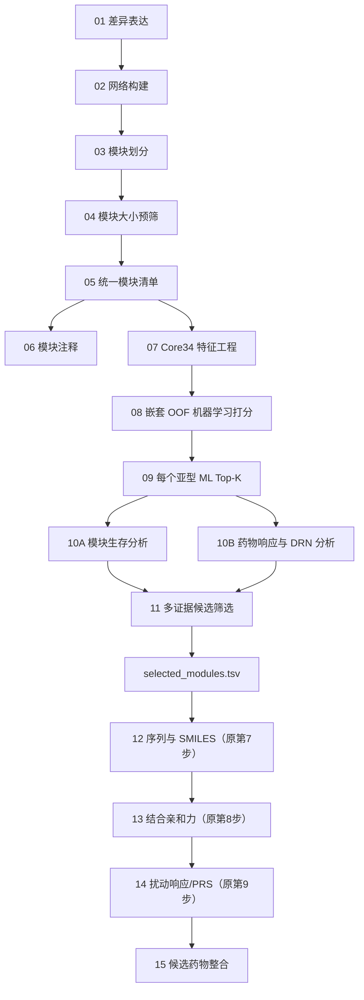

# ML-SnpDR

**Machine-Learning-Guided Subtype-Specific Network Drug Repurposing**

ML-SnpDR 是在 [subnetDR](https://github.com/LilyYNY/subnetDR) 基础上规划的肺腺癌（LUAD）亚型特异性网络药物重定位流程。它在 `ModuleSelection` 之后增加模块特征工程、机器学习亚型打分、模块生存分析、药物响应证据整合和候选模块筛选；只有通过筛选的模块才能进入原 subnetDR 第 7、8、9 步（序列/SMILES、结合亲和力、扰动响应评分）。

> **当前版本：0.0.1（流程骨架版）**
>
> 目前可以运行配置读取与校验、模块统一编号、流程阶段查询和 dry-run。完整的特征计算、ML、生存、药物响应及 subnetDR 第 7–9 步尚未迁入，因此当前版本不能直接生成最终候选药物结果。

## 1. 总体流程



机器学习概率表示模块的“亚型代表性/判别性”，不等同于治疗效果或可成药性。候选模块还必须通过生存、模块规模和药物响应等独立证据筛选。

## 2. 当前能做什么

| 功能 | 状态 | 说明 |
|---|---|---|
| YAML 配置读取、默认值合并和校验 | **可用** | 支持论文复现、快速和敏感性分析模式 |
| 网络名、模块算法名标准化 | **可用** | 统一历史文件中的大小写及拼写 |
| `module_uid` 创建和解析 | **可用** | 为 R/Python 及全部结果表提供统一主键 |
| 15 阶段流程注册表 | **可用** | 查看阶段顺序、分析范围和实现状态 |
| 配置优先的 dry-run | **可用** | 校验参数并返回执行计划，不运行科学计算 |
| `module_manifest.tsv` 和 `selected_modules.tsv` 数据契约 | **可用（契约）** | JSON Schema 已建立；清单生成器尚未实现 |
| ModuleSelection 输出适配 | **待实现** | 将节点/边文件转为统一模块清单 |
| Core34 特征工程 | **待实现** | 表达、拓扑、突变、TF 调控和跨来源稳定性特征 |
| 嵌套 OOF 机器学习评分 | **待实现** | 亚型概率、亚型内排名和模型评估 |
| 模块生存分析 | **待实现** | 连续 Cox、KM、最优截点、方向及 FDR |
| 药物响应与 DRN | **待实现** | PRISM、GDSC1、GDSC2、CTRP2 |
| 多证据候选模块筛选 | **待实现** | 输出逐步筛选轨迹和 `selected_modules.tsv` |
| subnetDR 第 7–9 步 | **待实现** | 仅处理 `selected_modules.tsv` 中的模块 |
| 候选药物综合排序 | **待实现** | 整合药物响应、结合亲和力和扰动响应证据 |

## 3. 安装

### 3.1 使用 Conda 创建完整开发环境

Python 要求 `>=3.9,<3.12`，R 要求 `>=4.2.0`。

```bash
git clone https://github.com/LilyYNY/ML-SnpDR.git
cd ML-SnpDR
conda env create -f environment.yml
conda activate mlsnpdr
```

`environment.yml` 会安装 R、Python 依赖，并以 editable 模式安装 Python 包。

### 3.2 只安装 R 包

在仓库根目录执行：

```bash
R CMD INSTALL .
```

仓库公开后也可以在 R 中安装：

```r
install.packages("remotes")
remotes::install_github("LilyYNY/ML-SnpDR")
```

### 3.3 只安装 Python 支持包

```bash
python -m pip install -e ".[dev]"
```

当前 Python 包仅提供模块编号工具；ML、药物响应等 Python 子包仍待迁入。

## 4. 五分钟快速使用

在仓库根目录启动 R：

```r
library(MLSnpDR)

run <- run_ml_snpdr_pipeline(
  config = "config/paper_luad.yml",
  dry_run = TRUE
)

run$status
run$plan
run$config$candidate_selection
```

返回值包括：

- `config`：校验和标准化后的配置；
- `plan`：请求运行的阶段、范围和实现状态；
- `status`：当前为 `"planned"`。

也可以只查看指定阶段：

```r
run_ml_snpdr_pipeline(
  config = "config/paper_luad.yml",
  stages = c("ml_scoring", "candidate_selection", "perturbation_score"),
  dry_run = TRUE
)$plan
```

当前若设置 `dry_run = FALSE`，程序会主动停止并提示完整执行器尚未启用，避免把未实现的流程误当作正式分析。

## 5. R 功能完整说明

当前 R 包导出 8 个函数。

### 5.1 `read_mlsnpdr_config()`：读取配置

读取 YAML 文件，可先载入默认配置，再用研究配置中的同名字段覆盖。

```r
config <- read_mlsnpdr_config(
  path = "config/paper_luad.yml",
  defaults = "config/default.yml"
)

config$project
config$ml$top_k_per_subtype
```

### 5.2 `validate_mlsnpdr_config()`：校验配置

检查必需配置段、分析模式、目标亚型、模块大小阈值、Top-K 和下游安全边界，并返回标准化后的列表。

```r
raw_config <- yaml::read_yaml("config/paper_luad.yml")
config <- validate_mlsnpdr_config(raw_config)
```

当前强制规则包括：

- 必须存在 `project`、`module_prefilter`、`ml`、`survival`、`candidate_selection`、`drug_response` 和 `post_selection`；
- `project.mode` 只能是 `paper_reproduction`、`fast` 或 `sensitivity`；
- 目标亚型只能是 `C1`–`C4`；
- 模块预筛阈值必须是非负数；
- `ml.top_k_per_subtype` 必须为正数并转换为整数；
- `post_selection.selected_only` 必须为 `true`，防止未入选模块进入下游。

### 5.3 `normalize_network_name()`：统一网络名称

目前支持三个受控网络名：`String`、`physicalPPIN`、`chengF`。

```r
normalize_network_name(c("string", "PhysicalPPIN", "cheng-f"))
# "String" "physicalPPIN" "chengF"

normalize_network_name("PhysicalPPIN", output = "slug")
# "physicalppin"
```

未知网络名会报错，避免同一网络因拼写不同被当作不同数据源。

### 5.4 `normalize_method_name()`：统一模块算法名称

目前支持 `Louvain` 和 `WF`。

```r
normalize_method_name(c("louvain", "WF"))
# "Louvain" "WF"

normalize_method_name("Louvain", output = "slug")
# "louvain"
```

### 5.5 `make_module_uid()`：生成统一模块主键

主键格式为：

```text
<network_slug>__<method_slug>__<subtype>__<module>
```

示例：

```r
make_module_uid("PhysicalPPIN", "louvain", "c3", "m10")
# "physicalppin__louvain__C3__M10"
```

函数支持长度兼容的向量化输入：

```r
make_module_uid(
  network = c("String", "physicalPPIN"),
  method = "WF",
  subtype = c("C1", "C3"),
  module = c("M2", "M10")
)
```

亚型必须为 `C1`–`C4`，模块必须为 `M<number>`。

### 5.6 `parse_module_uid()`：解析统一模块主键

```r
parse_module_uid("physicalppin__louvain__C3__M10")
```

返回字段：

- `module_uid`：规范主键；
- `legacy_module_id`：兼容旧表的 `physicalPPIN|Louvain|C3|M10`；
- `network`、`method`、`subtype`、`module`：独立身份字段。

### 5.7 `mlsnpdr_stage_registry()`：查询流程阶段

```r
stages <- mlsnpdr_stage_registry()
stages
subset(stages, implemented)
```

返回四列：`stage`、`name`、`scope` 和 `implemented`。其中第 05 阶段的 `implemented = TRUE` 表示模块清单的标识与数据契约已建立，不表示 ModuleSelection 文件适配器已经完成。

### 5.8 `run_ml_snpdr_pipeline()`：流程统一入口

```r
run_ml_snpdr_pipeline(
  config,
  defaults = NULL,
  stages = NULL,
  dry_run = TRUE
)
```

参数说明：

| 参数 | 含义 |
|---|---|
| `config` | 主 YAML 配置文件路径 |
| `defaults` | 可选默认 YAML；先读取，再由主配置覆盖 |
| `stages` | 可选阶段名称向量；为空时返回全部 15 阶段 |
| `dry_run` | 当前必须使用 `TRUE`；仅校验并返回计划 |

## 6. Python 功能完整说明

### 6.1 `make_module_uid()`

```python
from mlsnpdr import make_module_uid

uid = make_module_uid("PhysicalPPIN", "louvain", "c3", "m10")
print(uid)
# physicalppin__louvain__C3__M10
```

### 6.2 `parse_module_uid()`

```python
from mlsnpdr import parse_module_uid

identity = parse_module_uid("physicalppin__louvain__C3__M10")
print(identity.network)           # physicalPPIN
print(identity.method)            # Louvain
print(identity.subtype)           # C3
print(identity.module)            # M10
print(identity.legacy_module_id)  # physicalPPIN|Louvain|C3|M10
```

Python 解析器只接受已经规范化的 `module_uid`，非规范大小写或格式会报错。

### 6.3 `ModuleIdentity`

不可变数据类，用于在 Python 阶段保存模块身份，并通过属性生成两种编号。

```python
from mlsnpdr import ModuleIdentity

identity = ModuleIdentity("String", "WF", "C1", "M2")
print(identity.uid)
print(identity.legacy_module_id)
```

## 7. 十五个流程阶段及其功能

| 阶段 | 名称 | 功能 | 主要输入 | 主要输出 | 状态 |
|---:|---|---|---|---|---|
| 01 | `diff_expression` | 按 LUAD 亚型获得差异表达蛋白/基因 | 表达矩阵、亚型标签 | 亚型 DEP 表 | 待迁入 |
| 02 | `network_construction` | 将 DEP 映射到多种 PPI 网络 | DEP、String/physicalPPIN/chengF | 亚型网络节点和边 | 待迁入 |
| 03 | `module_detection` | 使用 Louvain、WF 划分网络模块 | PPI 子网络 | 模块节点/边文件 | 待迁入 |
| 04 | `module_prefilter` | 按模块规模作首次预筛 | ModuleDivision 结果 | `module_size > 9` 的模块 | 待迁入 |
| 05 | `module_manifest` | 统一模块身份、路径、大小及校验和 | 模块节点/边文件 | `module_manifest.tsv` | 标识和 Schema 可用；生成器待实现 |
| 06 | `module_annotation` | 对模块执行通路/功能注释 | manifest、功能数据库 | 模块注释表 | 待实现；报告支路 |
| 07 | `module_features` | 计算版本化的 `core34_v1` 特征 | manifest、表达、拓扑、突变、TF 等 | 34 特征矩阵和 QC | 待迁入 |
| 08 | `ml_scoring` | 嵌套 CV 评估并产生 OOF 亚型概率 | Core34、真实亚型 | OOF 概率、模型指标、模型卡 | 待迁入 |
| 09 | `ml_topk_pool` | 按目标亚型概率形成候选池 | OOF 分数 | 每亚型 Top-K 模块 | 待实现 |
| 10 | `survival_and_drug_response` | 并行整合预后与药物证据 | ML 候选、临床、表达、药敏数据 | 生存汇总、药物汇总、DRN | 待迁入 |
| 11 | `candidate_selection` | 依据配置执行逐步证据门控和排序 | ML、生存、规模、药物证据 | `stepwise_filtering.tsv`、`selected_modules.tsv` | 待实现 |
| 12 | `sequence_smiles` | 获取入选模块靶点序列和药物 SMILES | selected manifest、DRN | 序列与 SMILES | 待迁入（原 subnetDR 第7步） |
| 13 | `binding_affinity` | 预测药物–靶点结合亲和力 | 序列、SMILES | 结合分数 | 待迁入（原第8步） |
| 14 | `perturbation_score` | 计算网络扰动响应/PRS | 模块 PPI、结合结果 | 扰动响应分数 | 待迁入（原第9步） |
| 15 | `candidate_integration` | 跨面板和多证据综合候选药物 | 药敏、结合、PRS | 最终候选药物表和报告 | 待实现 |

第 12–15 阶段的范围被固定为 `selected_modules_only`，不得重新扫描所有模块。

## 8. Core34 机器学习功能设计

计划的 `core34_v1` 包含：

- 7 项 GSFM/表达特征；
- 12 项网络拓扑特征；
- 6 项突变特征；
- 5 项 TF/调控特征；
- 4 项跨来源稳定性特征。

训练与评分将严格区分：

- `oof_probability`：训练模块通过嵌套交叉验证获得的 OOF 概率，用于论文模块排名；
- `fitted_model_probability`：最终模型对外部新模块的推理概率。

二者不得合并到同一列或用于相同含义。身份字段（如 `network`、`method` 和 `module_uid`）不进入模型特征。

## 9. 生存分析功能设计

模块分数默认为模块成员基因的标准化表达均值。计划输出：

- 样本数和事件数；
- 模块基因匹配比例；
- 连续 Cox HR（每 1 SD）及 P/FDR；
- 最优截点及高低组样本数；
- Kaplan–Meier/log-rank P/FDR；
- 高分组相对低分组 HR；
- `High_score_worse` 或相反的预后方向；
- 是否通过预后门槛。

论文复现配置要求高分组预后更差且 log-rank `P < 0.05`。

## 10. 药物响应和 DRN 功能设计

计划支持四个药敏面板：

- PRISM；
- GDSC1；
- GDSC2；
- CTRP2。

每个模块计划输出显著药物数、实际测试药物数、`drug_response_density = drug_number / module_size`、DRN 边数、效应方向、P 值及多重检验方式。论文复现以 PRISM 为主面板；其他面板作为补充或敏感性证据。

## 11. 候选模块筛选规则

`config/paper_luad.yml` 编码了当前 LUAD 论文复现规则，但执行器尚待实现：

1. 初筛要求 `module_size > 9`；
2. 按目标亚型的嵌套 OOF 概率降序取 Top 10；
3. 要求预测亚型与目标亚型一致；
4. 要求 `High_score_worse`；
5. 要求最优截点 log-rank `P < 0.05`；
6. 要求 `module_size >= 30`；
7. 以 PRISM 为主面板，依次按显著药物数、药物响应密度和目标亚型概率排序；
8. 每个目标亚型默认选 1 个模块；
9. 只有入选模块进入原 subnetDR 第 7–9 步。

正式实现必须同时输出完整的逐步筛选轨迹、每一步的排除原因及确定性的并列排序规则。

## 12. 配置文件全部参数

仓库提供：

- `config/default.yml`：四个亚型的快速模式默认配置；
- `config/paper_luad.yml`：当前 C3 论文复现配置；
- `inst/config/`：安装 R 包后可通过 `system.file()` 获取的配置副本。

安装包后读取内置配置：

```r
paper_config <- system.file("config", "paper_luad.yml", package = "MLSnpDR")
read_mlsnpdr_config(paper_config)
```

| 配置段 | 字段 | 功能 |
|---|---|---|
| `project` | `name` | 项目名称 |
|  | `seed` | 全流程随机种子 |
|  | `target_subtypes` | 要分析的 `C1`–`C4` 亚型 |
|  | `mode` | `paper_reproduction`、`fast` 或 `sensitivity` |
| `paths` | `input_root` | 不纳入 Git 的输入数据根目录 |
|  | `results_root` | 结果目录 |
|  | `cache_root` | 缓存目录 |
| `module_prefilter` | `min_size_exclusive` | 严格大于该值才通过初筛 |
| `ml` | `feature_set` | 特征集版本，目前规划为 `core34_v1` |
|  | `ranking_score` | 排名分数，目前为目标亚型嵌套 OOF 概率 |
|  | `top_k_per_subtype` | 每个目标亚型的 ML 候选数量 |
|  | `require_predicted_subtype_match` | 是否要求预测亚型一致 |
|  | `probability_min` | 可选的最低概率门槛 |
|  | `margin_min` | 可选的第一、第二类别概率差门槛 |
| `survival` | `score_method` | 模块分数算法 |
|  | `endpoint` | 生存终点，当前为 OS |
|  | `cutpoint_method` | 高低组截点算法 |
|  | `min_group_fraction` | 每个组的最小样本比例 |
|  | `required_direction` | 要求的预后方向 |
|  | `logrank_p_max` | log-rank 名义 P 门槛 |
|  | `logrank_fdr_max` | 可选 FDR 门槛 |
|  | `report_continuous_cox` | 是否报告连续 Cox |
| `candidate_selection` | `min_module_size` | 最终选择的模块规模下限 |
|  | `primary_drug_panel` | 主药物面板 |
|  | `sort_by` | 最终排序字段及方向 |
|  | `select_n_per_subtype` | 每个亚型最终模块数 |
| `drug_response` | `panels` | 参与分析的药敏面板 |
|  | `analysis_scope` | 分析全部预筛模块或仅 ML Top-K |
|  | `significance_metric` | 显著性指标 |
|  | `significance_cutoff` | 显著性阈值 |
|  | `p_adjust_method` | 多重检验方法；论文复现为 `none` |
| `post_selection` | `run_original_steps` | 入选后运行的 subnetDR 步骤 |
|  | `selected_only` | 强制只处理入选模块，必须为 `true` |

## 13. 输入数据要求

完整流程实现后预计需要：

- 蛋白/基因表达矩阵及样本亚型；
- 差异表达结果或其原始输入；
- String、physicalPPIN、chengF 网络；
- ModuleDivision/ModuleSelection 的节点和边文件；
- 突变和 TF 调控数据；
- OS 时间、结局及必要临床字段；
- PRISM、GDSC1、GDSC2、CTRP2 药敏训练数据；
- 药物–靶点关系、蛋白序列和药物 SMILES。

患者级表达和临床数据不得提交到 GitHub。`data/raw/`、`data/processed/`、`results/` 和 `cache/` 已被 `.gitignore` 排除。每个外部资源应记录来源、版本、下载日期、许可条件和 SHA256。

## 14. 输出数据契约

### 14.1 `module_manifest.tsv`

每行表示一个模块。`schemas/module_manifest.schema.json` 定义了至少以下字段：

```text
module_uid, legacy_module_id, network, method, subtype, module,
module_size, node_file, edge_file, prefilter_pass, prefilter_reason,
node_sha256, edge_sha256
```

所有模块级表必须用 `module_uid` 连接，不再依赖目录层级或文件名猜测模块身份。

### 14.2 `selected_modules.tsv`

`schemas/selected_modules.schema.json` 定义最终入选模块的最小字段：

```text
module_uid, network, method, subtype, module, module_size,
primary_drug_panel, drn_file, drn_info_file, node_file, edge_file,
selection_rank, selection_reason
```

原 subnetDR 第 7–9 步只能读取此文件所列模块。

## 15. 测试和质量检查

### R

Windows PowerShell：

```bash
R.exe CMD build .
R.exe CMD check --no-manual MLSnpDR_0.0.1.tar.gz
```

macOS/Linux 将 `R.exe` 改为 `R`。先构建源码包再检查，可以避免把 Git 文件和检查目录误判为 R 包内容。

当前 R 测试覆盖：

- 配置文件可读取；
- C3、Top 10 和 `selected_only` 等论文配置；
- 禁止关闭 selected-only 边界；
- 网络名、算法名和模块 UID 标准化；
- UID 创建–解析往返；
- 未知网络或算法必须报错。

### Python

```bash
python -m pip install -e ".[dev]"
python -m pytest
```

当前 Python 测试覆盖 UID 标准化、往返解析和非法网络报错。GitHub Actions 会在 push 和 pull request 时分别运行 R CMD check 与 Python pytest。

## 16. 开发路线

- [x] 仓库元数据、R/Python 包骨架和 CI
- [x] 版本化 YAML 配置与安全边界
- [x] R/Python 统一模块编号
- [x] dry-run 和 15 阶段注册表
- [x] 模块清单与最终入选清单 Schema
- [ ] ModuleSelection 输出适配器和真实 `module_manifest.tsv`
- [ ] Core34 特征工程及 QC
- [ ] 嵌套 OOF ML 训练、评估、评分和模型卡
- [ ] 生存分析与药物响应/DRN
- [ ] 多证据候选模块筛选器
- [ ] selected-only 的序列/SMILES、结合和扰动响应步骤
- [ ] 非敏感最小示例数据和端到端回归测试

详细迁移与统计设计见 [`docs/architecture.md`](docs/architecture.md)。

## 17. 引用、许可与贡献

如果使用本软件，请引用 `CITATION.cff` 中的软件条目以及关联论文。仓库采用 MIT License；基于 subnetDR 的迁移或改写部分保留上游归属说明，详见 `LICENSE.md` 和 `NOTICE`。

开发规则见 [`CONTRIBUTING.md`](CONTRIBUTING.md)。请勿提交患者级数据、API 缓存、生成结果树、访问令牌或机器特定的绝对路径。
