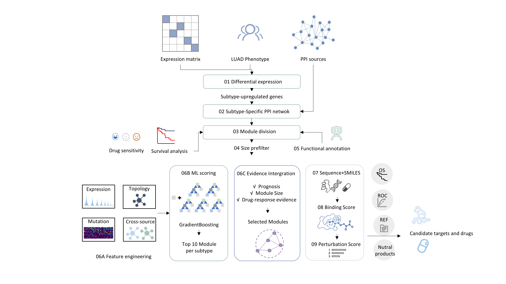

# ML-SnpDR

Machine Learning-guided signature-network-perturbation-based Drug Repositioning 

ML-SnpDR builds on [SnpDR](https://github.com/CSB-SUDA/SnpDR) to provide a LUAD subtype-specific network drug-repurposing workflow. The main extension follows the original steps 4–6: all modules retained in step 4 are annotated and evaluated for drug response, Core34 features, and machine-learning scores; the top 10 ML-ranked modules from each subtype are then combined with survival and drug-response evidence to select one optimal module per subtype; finally, only the selected modules enter subnetDR steps 7–9.

All steps from 1 through 9 are implemented. By default, the top-level runner starts from an expression matrix and subtype phenotype table, then generates differential-expression results, subtype-specific PPI networks, network modules, a module manifest, functional annotations, drug-response evidence, Core34 features, ML top-10 rankings, optimal modules, and final drug-target candidates. The pipeline can also start from any existing intermediate result.

## Workflow

<p align="center">
  
</p>

ML probabilities represent how strongly a module characterizes a subtype; they do not directly indicate efficacy or druggability. The ML top 10 must therefore undergo additional filtering by survival, module size, and drug-response evidence.

## Feature status

| Step | Function | Analysis scope | Primary output | Status |
|---|---|---|---|---|
| 01 | `run_diff_expr_analysis()` | All samples; each subtype vs all other samples | `differential_expression.tsv` | Available |
| 02 | `run_network_construction()` | Significantly upregulated proteins per subtype × PPI source | `network_manifest.tsv`, subtype PPI files | Available |
| 03 | `module_division()` / `subtype_module()` | Subtype × network × Louvain/WF | `module_division_manifest.tsv` | Available |
| 04 | `module_selection()` | All size-prefiltered modules | `module_manifest.tsv` | Available |
| 05 | `functional_annotation()` | All modules in the manifest | `module_annotation.tsv` | Available |
| 06 | `drug_response_analysis()` | All manifest modules × panels | `drug_response_summary.tsv`, DRN files | Available |
| 06A | `prepare_module_features()` | All manifest modules | `module_features.tsv`, `feature_schema.json` | Available |
| 06B | `prepare_ml_scores()` / `run_nested_ml_scoring()` | All modules; top 10 per subtype | `ml_scores.tsv`, `ml_top10.tsv` | Available |
| 06C | `triage_modules()` | ML top 10 for each subtype | `selected_modules.tsv`, filtering trace | Available |
| 07 | `run_SEQCre()` | Optimal module from each subtype | `seq_smiles_manifest.tsv` | Available |
| 08 | `predict_BA()` | Optimal module from each subtype | `binding_scores.tsv` | Available |
| 09 | `process_prs_dti()` | Optimal module from each subtype | `perturbation_scores.tsv`, `final_candidates.tsv` | Available |

The package also provides YAML configuration merging and validation, network/algorithm name normalization, `module_uid` creation and parsing, a stage registry, dry-run planning, input-coverage checks, SHA256 provenance tracking, and stage-level QC.

## Input/output overview

Use the following table to prepare inputs quickly. For complete field definitions, accepted column aliases, status fields, and strict validation rules, see the [input/output contracts](docs/io-contracts.md).

| Step | Custom inputs | Minimum input format | Primary outputs | Downstream use |
|---|---|---|---|---|
| 01 DEPs | Expression matrix, sample-subtype table, detection/FC/P thresholds | Expression wide table: `gene,<sample...>`; phenotype: `Sample,Subtype` | `differential_expression.tsv`, significant results, summary, compatible Excel workbook | Subtype protein sets for step 2 |
| 02 NetworkConstruction | Differential-expression table, PPI index or named edge files, score threshold | PPI index: at least `network,edge_file`; edge table: at least two endpoint columns | `network_manifest.tsv`, `ppi_<subtype>.txt` for each subtype/network | Network input for step 3 |
| 03 ModuleDivision | Network manifest, networks/algorithms, seed, WF threshold | Manifest: `network,subtype,ppi_file` | `module_division_manifest.tsv`, module node/edge files | Module-selection input for step 4 |
| 04 ModuleSelection | ModuleDivision root, subtypes, networks, algorithms, size threshold | Node table: `node,module`; edge table: `node1,node2,module` | `module_manifest.tsv`, per-module `nodes.tsv/edges.tsv` | Complete module set shared by steps 5, 6, 6A, and 6C |
| 05 ModuleAnnotation | `module_manifest.tsv`, GMT/TSV/CSV/XLSX gene sets, background genes | Long table: `term_id,gene`; optional `database,description` | `module_annotation.tsv`, Top-N results, QC | Biological interpretation and reporting |
| 06 DrugResponse | Manifest; roots for four panels or an explicit index | Index: `module_uid,drug_panel,drn_file,drn_info_file` | `drug_response_summary.tsv`, `drug_response_hits.tsv`, standardized DRNs | Drug-response evidence for step 6C |
| 06A ModuleFeatures | Manifest and all-module Core34 table | `module_uid` + 34 numeric features | `module_features.tsv`, `feature_schema.json`, QC | ML input for step 6B |
| 06B MLScoring | Features + schema, or an existing all-module probability table | Probability table: `module_uid,prob_C1,prob_C2,prob_C3,prob_C4` | `ml_scores.tsv`, `ml_top10.tsv` | Per-subtype candidate set for step 6C |
| 06C ModuleTriage | Manifest, ML top 10, survival table, drug-response summary | Survival table requires at least `module_uid,logrank_p,survival_direction` | `module_evidence.tsv`, `module_filtering_stepwise.tsv`, `selected_modules.tsv` | Defines the selected-module boundary for steps 7–9 |
| 07 SEQCre | Selected modules, protein-sequence table, drug-SMILES table | `node,sequence`; `node,smiles` | `seq_smiles_manifest.tsv`, per-module sequences/SMILES | DPI and binding-prediction input for step 8 |
| 08 BindingScore | Selected modules, sequence/SMILES manifest, binding-score table or predictor | `module_uid,target_name,drug_name,binding_score` | `binding_scores.tsv`, `binding_score_manifest.tsv` | Binding evidence for step 9 |
| 09 PScore | Selected modules, binding results, sensitivity table or ENM/PRS function | `module_uid,target_name,sensitivity` | `perturbation_scores.tsv`, `final_candidates.tsv` | Final subtype-specific drug-target candidates |

The workflow has two distinct data boundaries:

- `module_manifest.tsv`: all modules retained by the step-4 size prefilter. Steps 5, 6, 6A, and 6B must not remove modules prematurely.
- `selected_modules.tsv`: the optimal modules selected for each subtype in step 6C. Steps 7, 8, and 9 may read only the modules and files listed in this table.

## Installation

```bash
git clone https://github.com/LilyYNY/ML-SnpDR.git
cd ML-SnpDR
conda env create -f environment.yml
conda activate mlsnpdr
R CMD INSTALL .
```

The R and Python components can also be installed separately:

```r
remotes::install_github("LilyYNY/ML-SnpDR")
```

```bash
python -m pip install -e ".[dev]"
```

## Canonical module identifier

All module-level tables use the following identifier:

```text
<network_slug>__<method_slug>__<subtype>__<module>
```

For example:

```r
make_module_uid("physicalPPIN", "Louvain", "C3", "M10")
# physicalppin__louvain__C3__M10
```

No stage should infer module identity from directory names. Module identity must be propagated through `module_uid` and explicit file paths.

## Running individual steps

The following examples show how each step consumes the output of the preceding step. Every function accepts custom input and output paths and does not call the global `setwd()` function.

### Step 1: differential expression for each subtype vs all other samples

**Method:** Following subnetDR, a one-versus-rest Wilcoxon rank-sum test is performed for each subtype with BH correction. A protein must meet the detection-rate threshold in both the target group and all remaining samples before it is labeled `up`, `down`, or `non_significant` according to the adjusted P value and fold change.

**Input:** An expression matrix, a sample-subtype table, and configurable detection-rate, fold-change, P-value, and multiple-testing parameters. The expression input is a wide table whose first column contains genes/proteins and whose remaining columns contain samples:

```text
gene    S001    S002    S003
EGFR    10.2    8.7     4.1
TP53    3.2     3.8     5.6
```

The subtype input must contain at least:

```text
Sample  Subtype
S001    C1
S002    C1
S003    C2
```

```r
deps <- run_diff_expr_analysis(
  expression_file = "data/raw/expression.xlsx",
  phenotype_file = "data/raw/subtype.xlsx",
  output_dir = "results/01_differential_expression",
  gene_column = "gene",
  sample_column = "Sample",
  subtype_column = "Subtype",
  detection_threshold = 0.80,
  fc_threshold = 2,
  p_threshold = 0.01,
  p_adjust_method = "BH",
  pseudocount = 1,
  write_legacy_excel = TRUE
)

diff_file <- attr(deps, "result_file")
```

**Output:**

- `differential_expression.tsv`: long-format results for every subtype and protein; the primary input to step 2.
- `differential_expression_significant.tsv`: `up` and `down` results only.
- `differential_expression_summary.tsv`: label counts for each subtype.
- `diff_expression_results_all.xlsx`: subtype-specific worksheets compatible with subnetDR.

The canonical long table contains `subtype,gene,mean_target,mean_other,fold_change,log2_fold_change,p_value,p_adjust,detection_target,detection_other,label,n_target,n_other`.

### Step 2: subtype-specific PPI networks from upregulated proteins

**Method:** By default, this step uses proteins labeled `up` for each subtype in step 1 and retains interactions from String, physicalPPIN, and chengF only when both endpoints belong to that subtype's protein set. PPI sources are specified through an explicit index rather than a hard-coded `./PPI` directory.

**Input:** The step-1 `differential_expression.tsv` file plus a PPI index or named PPI edge files. The simplest PPI index is:

```text
network        edge_file
String         PPI/String/string_symbol_edges.tsv
physicalPPIN   PPI/PhysicalPPIN/physicalppi.tsv
chengF         PPI/ChengF/chengf_symbol_edges.tsv
```

If the source PPI uses database identifiers, add the following columns:

```text
network, edge_file, node1_column, node2_column,
score_column, score_min, delimiter,
mapping_file, mapping_id_column, mapping_symbol_column, mapping_delimiter
```

Relative `edge_file` and `mapping_file` paths are resolved against the PPI index file. Use `delimiter=whitespace` for whitespace-delimited String files and `mapping_delimiter=tab` for tab-delimited mapping tables.

```r
networks <- run_network_construction(
  diff_file = diff_file,
  ppi_index_file = "data/raw/ppi_index.tsv",
  output_dir = "results/02_network_construction",
  ppi_method = c("String", "physicalPPIN", "chengF"),
  ppiScore = 400,
  include_labels = "up",
  subtypes = c("C1", "C2", "C3", "C4")
)

network_manifest_file <- attr(networks, "manifest_file")
```

**Output:**

- `network_manifest.tsv`: one row per subtype-network combination.
- `<subtype>/<network>/ppi_<subtype>.txt`: canonical `node1,node2` edge table.
- Network node/edge counts, source paths, status, and SHA256 checksums.

### Step 3: Louvain/WF module division

**Method:** `Louvain` runs directly on an undirected, deduplicated, self-loop-free PPI network. `WF` runs edge-betweenness and label propagation separately, applies a hypergeometric overlap test to the two module sets, and then uses P values and overlap size to define non-overlapping consensus modules.

**Input:** The step-2 `network_manifest.tsv` plus the requested subtypes, networks, module algorithms, random seed, and WF significance threshold.

```r
divisions <- module_division(
  network_manifest_file = network_manifest_file,
  output_base_path = "results/03_module_division",
  network_method = c("String", "physicalPPIN", "chengF"),
  module_method = c("Louvain", "WF"),
  subtypes = c("C1", "C2", "C3", "C4"),
  seed = 123,
  wf_pvalue_cutoff = 0.05,
  strict = TRUE
)

module_division_dir <- attr(divisions, "output_dir")
```

**Output:** Each subtype-network-algorithm combination generates:

- `node_Module_<network>_<method>.txt`: `node,module`.
- `edges_<network>_<method>.txt`: `node1,node2,module`, with cross-module edges assigned to module 0.
- `edge_Module_<network>_<method>.txt`: within-module edges only.
- Root-level `module_division_manifest.tsv`: all combinations, counts, paths, parameters, and SHA256 checksums.

### Step 4: ModuleSelection → manifest

**Method:** Count unique nodes in every step-3 module and retain all modules satisfying `module_size > numberCutoff`. Module 0 and self-loops are excluded. subnetDR-compatible aggregate files are retained, and each module receives a unique `module_uid`, standalone node/edge files, and SHA256 checksums.

**Input:** The step-3 module-division root, subtype table, network names, module-algorithm names, and module-size threshold. Node tables must contain at least `node,module`, and edge tables must contain at least `node1,node2,module`.

```r
library(MLSnpDR)

modules <- module_selection(
  subtype_file = "data/subtype.xlsx",
  base_input_path = module_division_dir,
  base_output_path = "results/04_module_selection",
  network_method = c("String", "physicalPPIN", "chengF"),
  module_method = c("Louvain", "WF"),
  numberCutoff = 9,
  strict = TRUE
)

manifest_file <- attr(modules, "manifest_file")
```

**Output:**

- `standardized/module_manifest.tsv`
- `standardized/modules/<module_uid>/nodes.tsv`
- `standardized/modules/<module_uid>/edges.tsv`
- subnetDR-compatible aggregate node/edge files and QC results.

If ModuleSelection outputs already exist, use `build_module_manifest()` to adapt them directly without rerunning module selection.

### Step 5: functional annotation of all modules

**Method:** Use module nodes as the query set and background genes as the universe, perform a hypergeometric over-representation test for each gene set, and apply the specified multiple-testing correction. Annotation is used for interpretation only and does not change the complete module set entering steps 6A/6B.

**Input:** The step-4 `module_manifest.tsv`, GMT/TSV/CSV/XLSX gene sets, background genes, and enrichment parameters. A long-format gene-set table must contain at least `term_id,gene`; `database,description` are optional.

```r
annotation <- functional_annotation(
  module_manifest_file = manifest_file,
  base_output_path = "results/05_module_annotation",
  gene_set_file = "data/gene_sets.gmt",
  background_gene_file = "data/background_genes.tsv",
  pAdjustMethod = "BH",
  pAdjustCutoff = 0.05,
  top_n = 15
)
```

`gene_set_file` may be TSV, CSV, XLSX, or GMT. If no custom gene set is supplied, `databases` can be used to query `msigdbr`.

**Output:** `module_annotation.tsv`, `module_annotation_top<N>.tsv`, `module_annotation_qc.tsv`, a parameter table, and optional per-module annotation files.

### Step 6: drug-response standardization for all modules

**Method:** Build an explicit module-panel index for every module in `module_manifest.tsv` and every requested drug-sensitivity panel, standardize existing DRN and DRN-info files, drug significance, and effect direction, and perform a full-coverage audit. This step does not remove modules on the basis of drug-response results.

**Input:** The step-4 `module_manifest.tsv` plus drug-response roots or an explicit index for PRISM, GDSC1, GDSC2, CTRP2, or other panels. The index must contain at least `module_uid,drug_panel,drn_file,drn_info_file`.

```r
drug <- drug_response_analysis(
  module_manifest_file = manifest_file,
  drug_response_path = "results/06_drug_response",
  drug_response_roots = c(
    PRISM = "existing/PRISM",
    GDSC1 = "existing/GDSC1",
    GDSC2 = "existing/GDSC2",
    CTRP2 = "existing/CTRP2"
  ),
  panels = c("PRISM", "GDSC1", "GDSC2", "CTRP2"),
  strict = TRUE
)

drug_summary_file <- attr(drug, "summary_file")
```

`drug_response_index_file` can be used instead of multiple root directories. The index must contain at least:

```text
module_uid, drug_panel, drn_file, drn_info_file
```

Optional columns are `drug_level_file` and `prediction_file`. Step 6 must cover all modules in the manifest rather than removing modules based on drug results beforehand.

**Output:** `drug_response_summary.tsv`, `drug_response_hits.tsv`, `drug_response_source_index.tsv`, `drug_response_coverage.tsv`, and standardized per-module DRN/DRN-info files.

### Step 6A: Core34 features for all modules

**Method:** Map the Core34 feature table one-to-one to the step-4 manifest, fix the feature order, verify complete module coverage, finite numeric values, missing-value counts, and module-size consistency, and record source hashes.

**Input:** The step-4 `module_manifest.tsv` and an all-module Core34 table. The feature table must contain one row per module and either `module_uid` or network/method/subtype/module columns that uniquely identify the module, together with 34 numeric features.

```r
features <- prepare_module_features(
  module_manifest_file = manifest_file,
  feature_file = "data/all_module_core34.tsv",
  output_dir = "results/06A_module_features",
  expected_feature_count = 34,
  feature_set = "core34_v1",
  strict = TRUE
)

feature_file <- attr(features, "feature_file")
feature_schema_file <- attr(features, "schema_file")
```

The output uses a fixed feature order and reports coverage, missing values, finite-value checks, and module-size consistency.

**Output:** `module_features.tsv`, `feature_schema.json`, and `module_features_qc.tsv`.

### Step 6B: nested OOF scoring and top 10 per subtype

**Method:** Run repeated nested stratified cross-validation with Gradient Boosting across all modules. Outer-fold OOF probabilities avoid in-sample scoring, and the probability assigned to each module's true subtype determines its within-subtype rank. After gates such as predicted-subtype matching, retain the top 10 modules per subtype. External model results that satisfy the same probability contract can also be imported.

**Input:** The step-6A `module_features.tsv` and `feature_schema.json`. When importing existing model results, the probability table must contain `module_uid,prob_C1,prob_C2,prob_C3,prob_C4`.

Run the bundled Python nested-OOF implementation directly:

```r
scores <- run_nested_ml_scoring(
  module_features_file = feature_file,
  feature_schema_file = feature_schema_file,
  output_dir = "results/06B_ml_scoring",
  mode = "paper",
  outer_splits = 5,
  outer_repeats = 5,
  inner_splits = 3,
  top_k = 10
)

ml_top_file <- attr(scores, "top_file")
```

Alternatively, import an existing probability table:

```r
scores <- prepare_ml_scores(
  module_features_file = feature_file,
  score_file = "data/all_module_probabilities.tsv",
  output_dir = "results/06B_ml_scoring",
  top_k = 10,
  require_predicted_subtype_match = TRUE
)
```

The program validates complete module coverage, probability sums, predicted subtypes, target-subtype probabilities, and within-subtype ranks.

**Output:** `ml_scores.tsv`, `ml_top10.tsv`, gate-audit results, CV-fold/model metadata, and `fitted_model.joblib` when using the bundled Python implementation.

### Step 6C: Top10 + survival + drug response → optimal module per subtype

**Method:** Within the ML top 10 for each subtype, join module-survival results with evidence from the primary step-6 drug-sensitivity panel. Apply prognosis-direction, log-rank, module-size, and drug-response gates in sequence, then rank modules by the predefined evidence priority.

**Input:** The step-4 `module_manifest.tsv`, the step-6B `ml_top10.tsv`, a module-survival table, and the step-6 `drug_response_summary.tsv`. The survival table must contain at least `module_uid,logrank_p,survival_direction`.

```r
selected <- triage_modules(
  module_manifest_file = manifest_file,
  ml_top_file = ml_top_file,
  survival_file = "data/module_survival.tsv",
  drug_response_summary_file = drug_summary_file,
  output_dir = "results/06C_module_triage",
  primary_drug_panel = "PRISM",
  min_module_size = 30,
  required_direction = "High_score_worse",
  logrank_p_max = 0.05,
  select_n_per_subtype = 1
)

selected_file <- attr(selected, "selected_file")
```

The default filtering order is: eligible ML top 10 → `High_score_worse` with log-rank P ≤ 0.05 → module size ≥ 30 → evidence from the primary drug-sensitivity panel → ranking by significant-drug count, drug-response density, and target-subtype probability → one selected module per subtype.

The output directory copies the node, edge, DRN, and DRN-info files for selected modules. Step 7 therefore depends only on `selected_modules.tsv` and its relative paths and no longer scans the complete module directory.

**Output:** `module_survival.tsv`, `module_evidence.tsv`, `module_filtering_stepwise.tsv`, `selected_modules.tsv`, and four self-contained handoff file types for the selected modules.

### Step 7: generate sequences/SMILES for selected modules only

**Method:** Read DRN-info paths from `selected_modules.tsv` row by row, extract only proteins/drugs that actually occur, join them to explicit sequence and SMILES lookup tables, and check coverage without recursively scanning other modules.

**Input:** The step-6C `selected_modules.tsv`, a protein-sequence table with `node,sequence`, and a drug-SMILES table with `node,smiles`.

```r
seqs <- run_SEQCre(
  input_base = selected_file,
  output_base = "results/07_sequence_smiles",
  protein_sequence_file = "data/protein_sequences.tsv",
  drug_smiles_file = "data/drug_smiles.tsv"
)

seq_manifest_file <- attr(seqs, "manifest_file")
```

Common column aliases are normalized, but the four column names above are recommended.

**Output:** `seq_smiles_manifest.tsv` plus `protein_sequences.tsv` and `drug_smiles.tsv` for each selected module.

### Step 8: calculate binding scores for selected modules only

**Method:** Construct drug-target pairs from selected DRNs, join step-7 target sequences and drug SMILES, and then import existing binding scores or call a user-supplied prediction function. Generate within-module ranks according to `lower_better` or `higher_better`.

**Input:** The step-6C `selected_modules.tsv`, the step-7 `seq_smiles_manifest.tsv`, and either a binding-score table or a user-supplied predictor. The binding-score table contains `module_uid,target_name,drug_name,binding_score`.

```r
binding <- predict_BA(
  selected_modules_file = selected_file,
  seq_smiles_manifest_file = seq_manifest_file,
  output_base = "results/08_binding_score",
  binding_score_file = "data/binding_scores.tsv",
  score_direction = "lower_better"
)

binding_file <- attr(binding, "scores_file")
```

A custom prediction function can be passed through `predictor`; exactly one of the file or function inputs must be supplied.

**Output:** `binding_scores.tsv`, `binding_score_manifest.tsv`, and per-module DPI/binding-score files.

### Step 9: PRS/perturbation scoring and final candidates

**Method:** Import or calculate target sensitivity from selected-module edge files, join it one-to-one with step-8 binding scores, calculate perturbation scores, and generate both within-module and within-subtype ranks.

**Input:** The step-6C `selected_modules.tsv`, the step-8 `binding_scores.tsv`, and either a sensitivity table or an ENM/PRS function. The sensitivity table contains `module_uid,target_name,sensitivity`.

```r
prs <- process_prs_dti(
  selected_modules_file = selected_file,
  binding_scores_file = binding_file,
  output_base = "results/09_perturbation_score",
  sensitivity_file = "data/target_sensitivity.tsv",
  top_n = 10
)
```

Alternatively, pass a `sensitivity_function`. The perturbation score follows the subnetDR definition:

```text
perturbation_score = binding_score × sensitivity
```

**Output:** `target_sensitivity.tsv`, `perturbation_scores.tsv`, and `final_candidates.tsv` containing the top `top_n` candidates for each subtype.

## Run steps 1–9 in one call

First set the raw-input and stage-output paths in `config/paper_luad.yml`. A complete run requires at least:

```text
paths.expression_file
paths.subtype_file
paths.ppi_index_file
paths.module_feature_input_file
paths.survival_input_file
drug_response.input_roots or paths.drug_response_input_index_file
paths.protein_sequence_file
paths.drug_smiles_file
paths.binding_score_input_file
paths.sensitivity_input_file
```

`paths.ml_score_input_file` is optional: when empty, the bundled nested-OOF implementation runs; when provided, an existing all-module probability table is imported. After configuration, the complete pipeline uses a single entry point:

```r
library(MLSnpDR)

plan <- run_ML_SnpDR(
  config = "config/paper_luad.yml",
  from = "deps",
  to = "perturbation_score",
  dry_run = TRUE
)

result <- run_ML_SnpDR(
  config = "config/paper_luad.yml",
  from = "deps",
  to = "perturbation_score",
  dry_run = FALSE
)
```

Because `from="deps"` is the default, a complete production run can be shortened to:

```r
result <- run_ML_SnpDR(
  config = "config/paper_luad.yml",
  dry_run = FALSE
)
```

The top-level runner follows the stage registry and passes each returned primary-output path directly to the dependent downstream stage. A contiguous subset can also be run, for example:

```r
run_ML_SnpDR(
  config = "config/paper_luad.yml",
  from = "module_features",
  to = "module_triage",
  dry_run = FALSE
)
```

When starting from an intermediate stage, the configuration must provide the input files produced by preceding stages. See the [input/output contracts](docs/io-contracts.md) for configuration fields and column definitions, and the [pipeline architecture](docs/architecture.md) for design boundaries.

## Validation on the current LUAD data

The code has been tested against the current project data using read-only inputs or isolated validation directories:

- Steps 1–3: a continuous DEPs → network manifest → Louvain/WF → ModuleSelection test using synthetic expression/PPI data.
- Step 4: 208 modules, with 63/44/49/52 modules for C1/C2/C3/C4, respectively; 14,261 node records and 95,889 edges after excluding 854 self-loops.
- Step 6: 208 modules × 4 panels = 832 module-panel combinations, with complete coverage for PRISM/GDSC1/GDSC2/CTRP2.
- Step 6A: 208 modules × 34 features, zero missing modules, and 208 modules passing QC.
- Step 6B: all 208 modules scored, with 10 per subtype and 40 ML top-10 modules in total.
- Step 6C: one module selected per subtype, with all four handoff file types confirmed.

These results validate code integration and data contracts. They do not replace a fixed computational environment, complete parameter records, or statistical review for the final manuscript analysis.

## Testing

```bash
Rscript -e "devtools::test()"
python -m pytest
R CMD check .
```

## License

MIT. Attribution and copyright for upstream subnetDR code and related methods remain with their original authors.
