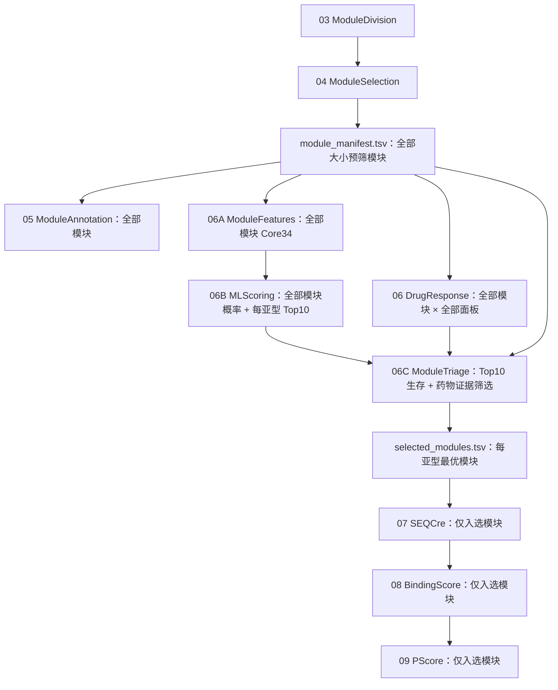

# ML-SnpDR

Machine-Learning-Guided Subtype-Specific Network Drug Repurposing

ML-SnpDR 基于 [subnetDR](https://github.com/LilyYNY/subnetDR) 重构 LUAD 亚型特异性网络药物重定位流程。核心改变发生在原流程第 4–6 步之后：先对第 4 步保留的全部模块完成注释、药物响应、Core34 特征和机器学习评分；每个亚型取机器学习 Top10，再结合生存和药物响应证据选出一个最优模块；最后只让这些入选模块进入 subnetDR 的第 7–9 步。

当前已实现并通过测试的是第 4、5、6、6A、6B、6C、7、8、9 步。第 1–3 步保留在注册表中，当前需要使用 subnetDR 或已有 ModuleDivision 结果作为起点。

## 流程



机器学习概率表示模块的亚型代表性，不等同于疗效或可成药性。因此，ML Top10 必须继续经过生存、模块大小和药物响应证据筛选。

## 功能状态

| 步骤 | 函数 | 分析范围 | 主输出 | 状态 |
|---|---|---|---|---|
| 01–03 | subnetDR 上游步骤 | 队列、亚型、网络 | ModuleDivision 文件 | 外部输入 |
| 04 | `module_selection()` | 全部大小预筛模块 | `module_manifest.tsv` | 可用 |
| 05 | `functional_annotation()` | manifest 全部模块 | `module_annotation.tsv` | 可用 |
| 06 | `drug_response_analysis()` | manifest 全部模块 × 面板 | `drug_response_summary.tsv`、DRN | 可用 |
| 06A | `prepare_module_features()` | manifest 全部模块 | `module_features.tsv`、`feature_schema.json` | 可用 |
| 06B | `prepare_ml_scores()` / `run_nested_ml_scoring()` | 全部模块；每亚型 Top10 | `ml_scores.tsv`、`ml_top10.tsv` | 可用 |
| 06C | `triage_modules()` | 每亚型 ML Top10 | `selected_modules.tsv`、筛选轨迹 | 可用 |
| 07 | `run_SEQCre()` | 每亚型最优模块 | `seq_smiles_manifest.tsv` | 可用 |
| 08 | `predict_BA()` | 每亚型最优模块 | `binding_scores.tsv` | 可用 |
| 09 | `process_prs_dti()` | 每亚型最优模块 | `perturbation_scores.tsv`、`final_candidates.tsv` | 可用 |

此外还提供 YAML 配置合并与校验、网络/算法名称标准化、`module_uid` 创建和解析、阶段注册表、dry-run、输入覆盖度检查、SHA256 来源追踪和逐步 QC。

## 每一步输入输出总览

下表用于快速准备文件。完整字段、允许的同义列、状态列和严格校验规则见 [每一步输入输出格式](docs/io-contracts.md)。

| 步骤 | 自定义输入 | 最小输入格式 | 主要输出 | 下游用途 |
|---|---|---|---|---|
| 04 ModuleSelection | ModuleDivision 根目录、亚型、网络、算法、大小阈值 | 节点表：`node,module`；边表：`node1,node2,module` | `module_manifest.tsv`、逐模块 `nodes.tsv/edges.tsv` | 第 5、6、6A、6C 步共享的模块全集 |
| 05 ModuleAnnotation | `module_manifest.tsv`、GMT/TSV/CSV/XLSX 基因集、背景基因 | 长表：`term_id,gene`，可选 `database,description` | `module_annotation.tsv`、Top-N、QC | 模块生物学解释和报告 |
| 06 DrugResponse | manifest；四个面板根目录或显式索引 | 索引：`module_uid,drug_panel,drn_file,drn_info_file` | `drug_response_summary.tsv`、`drug_response_hits.tsv`、标准化 DRN | 第 6C 步药物响应证据 |
| 06A ModuleFeatures | manifest、全模块 Core34 表 | `module_uid` + 34 个数值特征 | `module_features.tsv`、`feature_schema.json`、QC | 第 6B 步机器学习输入 |
| 06B MLScoring | features + schema，或已有全模块概率表 | 概率表：`module_uid,prob_C1,prob_C2,prob_C3,prob_C4` | `ml_scores.tsv`、`ml_top10.tsv` | 第 6C 步每亚型候选集合 |
| 06C ModuleTriage | manifest、ML Top10、生存表、药物响应汇总 | 生存表至少需要 `module_uid,logrank_p,survival_direction` | `module_evidence.tsv`、`module_filtering_stepwise.tsv`、`selected_modules.tsv` | 建立第 7–9 步的入选模块边界 |
| 07 SEQCre | selected、蛋白序列表、药物 SMILES 表 | `node,sequence`；`node,smiles` | `seq_smiles_manifest.tsv`、逐模块序列/SMILES | 第 8 步 DPI 和结合预测输入 |
| 08 BindingScore | selected、sequence/SMILES manifest、结合分数表或预测函数 | `module_uid,target_name,drug_name,binding_score` | `binding_scores.tsv`、`binding_score_manifest.tsv` | 第 9 步结合证据 |
| 09 PScore | selected、binding、敏感性表或 ENM/PRS 函数 | `module_uid,target_name,sensitivity` | `perturbation_scores.tsv`、`final_candidates.tsv` | 最终每亚型药物-靶点候选 |

这里有两个不能混淆的数据边界：

- `module_manifest.tsv`：第 4 步大小预筛后的全部模块；第 5、6、6A 和 6B 步不得提前删除其中的模块。
- `selected_modules.tsv`：第 6C 步每亚型筛出的最优模块；第 7、8、9 步只能读取这份表列出的模块和文件。

## 安装

```bash
git clone https://github.com/LilyYNY/ML-SnpDR.git
cd ML-SnpDR
conda env create -f environment.yml
conda activate mlsnpdr
R CMD INSTALL .
```

也可以分别安装：

```r
remotes::install_github("LilyYNY/ML-SnpDR")
```

```bash
python -m pip install -e ".[dev]"
```

## 统一模块主键

全部模块级表使用：

```text
<network_slug>__<method_slug>__<subtype>__<module>
```

例如：

```r
make_module_uid("physicalPPIN", "Louvain", "C3", "M10")
# physicalppin__louvain__C3__M10
```

任何一步都不能靠目录名重新猜测模块身份，必须通过 `module_uid` 和显式文件路径传递。

## 单步运行

以下示例展示每一步怎样直接使用上一步的输出。每个函数都允许自定义输入和输出位置，且不调用全局 `setwd()`。

### 第 4 步：ModuleSelection → manifest

```r
library(MLSnpDR)

modules <- module_selection(
  subtype_file = "data/subtype.xlsx",
  base_input_path = "results/03_module_division",
  base_output_path = "results/04_module_selection",
  network_method = c("String", "physicalPPIN", "chengF"),
  module_method = c("Louvain", "WF"),
  numberCutoff = 9,
  strict = TRUE
)

manifest_file <- attr(modules, "manifest_file")
```

主要输出：

- `standardized/module_manifest.tsv`
- `standardized/modules/<module_uid>/nodes.tsv`
- `standardized/modules/<module_uid>/edges.tsv`
- subnetDR 兼容的聚合节点/边文件和 QC

如果已经有 ModuleSelection 输出，可使用 `build_module_manifest()` 直接适配，无需重跑模块筛选。

### 第 5 步：全部模块功能注释

```r
annotation <- functional_annotation(
  module_manifest_file = manifest_file,
  base_output_path = "results/05_module_annotation",
  gene_set_file = "data/gene_sets.gmt",
  background_gene_file = "data/background_genes.tsv",
  pAdjustMethod = "BH",
  pAdjustCutoff = 0.05,
  top_n = 15
)
```

`gene_set_file` 可为 TSV、CSV、XLSX 或 GMT。长表至少包含 `term_id` 和 `gene`；可选 `database`、`description`。若不提供自定义基因集，可通过 `databases` 调用 `msigdbr`。

### 第 6 步：全部模块药物响应标准化

```r
drug <- drug_response_analysis(
  module_manifest_file = manifest_file,
  drug_response_path = "results/06_drug_response",
  drug_response_roots = c(
    PRISM = "existing/PRISM",
    GDSC1 = "existing/GDSC1",
    GDSC2 = "existing/GDSC2",
    CTRP2 = "existing/CTRP2"
  ),
  panels = c("PRISM", "GDSC1", "GDSC2", "CTRP2"),
  strict = TRUE
)

drug_summary_file <- attr(drug, "summary_file")
```

也可用 `drug_response_index_file` 代替多个根目录。索引至少包含：

```text
module_uid, drug_panel, drn_file, drn_info_file
```

可选列为 `drug_level_file`、`prediction_file`。第 6 步必须覆盖 manifest 中的全部模块，而不是先按药物结果删模块。

### 第 6A 步：全部模块 Core34 特征

```r
features <- prepare_module_features(
  module_manifest_file = manifest_file,
  feature_file = "data/all_module_core34.tsv",
  output_dir = "results/06A_module_features",
  expected_feature_count = 34,
  feature_set = "core34_v1",
  strict = TRUE
)

feature_file <- attr(features, "feature_file")
feature_schema_file <- attr(features, "schema_file")
```

输入必须一行一个模块，包含 `module_uid`，或包含可唯一构造身份的 network/method/subtype/module 列，以及 34 个数值特征。输出固定特征顺序，并检查覆盖度、缺失值、有限值和模块大小一致性。

### 第 6B 步：嵌套 OOF 评分和每亚型 Top10

直接运行内置 Python 嵌套 OOF：

```r
scores <- run_nested_ml_scoring(
  module_features_file = feature_file,
  feature_schema_file = feature_schema_file,
  output_dir = "results/06B_ml_scoring",
  mode = "paper",
  outer_splits = 5,
  outer_repeats = 5,
  inner_splits = 3,
  top_k = 10
)

ml_top_file <- attr(scores, "top_file")
```

也可以导入已有概率表：

```r
scores <- prepare_ml_scores(
  module_features_file = feature_file,
  score_file = "data/all_module_probabilities.tsv",
  output_dir = "results/06B_ml_scoring",
  top_k = 10,
  require_predicted_subtype_match = TRUE
)
```

概率表必须包含 `module_uid` 和 `prob_C1`、`prob_C2`、`prob_C3`、`prob_C4`。程序校验全模块覆盖、概率和、预测亚型、目标亚型概率和亚型内排名。

### 第 6C 步：Top10 + 生存 + 药物响应 → 每亚型最优模块

```r
selected <- triage_modules(
  module_manifest_file = manifest_file,
  ml_top_file = ml_top_file,
  survival_file = "data/module_survival.tsv",
  drug_response_summary_file = drug_summary_file,
  output_dir = "results/06C_module_triage",
  primary_drug_panel = "PRISM",
  min_module_size = 30,
  required_direction = "High_score_worse",
  logrank_p_max = 0.05,
  select_n_per_subtype = 1
)

selected_file <- attr(selected, "selected_file")
```

默认筛选顺序为：ML 合格 Top10 → `High_score_worse` 且 log-rank P ≤ 0.05 → 模块大小 ≥ 30 → 有主药敏面板证据 → 按显著药物数、药物响应密度和目标亚型概率排序 → 每个亚型选择 1 个模块。

输出目录会复制入选模块的 node、edge、DRN 和 DRN-info 文件，因此第 7 步只依赖 `selected_modules.tsv` 及其相对路径，不再扫描全部模块目录。

### 第 7 步：仅为入选模块生成 sequence/SMILES

```r
seqs <- run_SEQCre(
  input_base = selected_file,
  output_base = "results/07_sequence_smiles",
  protein_sequence_file = "data/protein_sequences.tsv",
  drug_smiles_file = "data/drug_smiles.tsv"
)

seq_manifest_file <- attr(seqs, "manifest_file")
```

蛋白表需要 `node,sequence`；药物表需要 `node,smiles`。常见同义列会被标准化，但推荐使用这四个列名。

### 第 8 步：仅为入选模块计算结合分数

```r
binding <- predict_BA(
  selected_modules_file = selected_file,
  seq_smiles_manifest_file = seq_manifest_file,
  output_base = "results/08_binding_score",
  binding_score_file = "data/binding_scores.tsv",
  score_direction = "lower_better"
)

binding_file <- attr(binding, "scores_file")
```

结合分数输入需要 `module_uid,target_name,drug_name,binding_score`。也可通过 `predictor` 传入用户自己的预测函数；文件和函数必须二选一。

### 第 9 步：PRS/扰动评分和最终候选

```r
prs <- process_prs_dti(
  selected_modules_file = selected_file,
  binding_scores_file = binding_file,
  output_base = "results/09_perturbation_score",
  sensitivity_file = "data/target_sensitivity.tsv",
  top_n = 10
)
```

敏感性表需要 `module_uid,target_name,sensitivity`。也可传入 `sensitivity_function`。扰动分数沿用 subnetDR 的定义：

```text
perturbation_score = binding_score × sensitivity
```

## 一次贯穿第 4–9 步

在 `config/paper_luad.yml` 中设置每一步路径后运行：

```r
library(MLSnpDR)

plan <- run_ML_SnpDR(
  config = "config/paper_luad.yml",
  from = "module_selection",
  to = "perturbation_score",
  dry_run = TRUE
)

result <- run_ML_SnpDR(
  config = "config/paper_luad.yml",
  from = "module_selection",
  to = "perturbation_score",
  dry_run = FALSE
)
```

总运行器按阶段注册表顺序执行，并把实际返回的主输出路径传给下一步。也可只运行连续子区间，例如：

```r
run_ML_SnpDR(
  config = "config/paper_luad.yml",
  from = "module_features",
  to = "module_triage",
  dry_run = FALSE
)
```

若从中间步骤开始，配置中必须提供前置步骤产生的输入文件。配置字段和所有列定义见 [输入输出契约](docs/io-contracts.md)，设计边界见 [流程架构](docs/architecture.md)。

## 当前 LUAD 数据验证

代码已在当前项目数据上完成只读或独立验证目录测试：

- 第 4 步：208 个模块，C1/C2/C3/C4 分别为 63/44/49/52；14,261 条节点记录、95,889 条边，排除 854 个自环。
- 第 6 步：208 模块 × 4 面板 = 832 个模块-面板组合，PRISM/GDSC1/GDSC2/CTRP2 均完整覆盖。
- 第 6A 步：208 个模块 × 34 个特征，缺失模块 0，QC 通过 208。
- 第 6B 步：208 个模块全部评分，每亚型 10 个，共 40 个 ML Top10 模块。
- 第 6C 步：每亚型选择 1 个模块，并确认 4 类交接文件均存在。

这部分结果用于验证代码连接和数据契约，不替代最终论文运行时的固定环境、参数记录和统计复核。

## 测试

```bash
Rscript -e "devtools::test()"
python -m pytest
R CMD check .
```

## 与 subnetDR 的关系

本仓库沿用 subnetDR 的科学工作流和第 7–9 步命名，但移除了这些步骤对全部目录的递归扫描，并把输入范围锁定到 `selected_modules.tsv`。建议同时引用原始 subnetDR 仓库及相应论文/方法来源。

## License

MIT。上游 subnetDR 代码和相关方法的署名与版权归其原作者所有。
