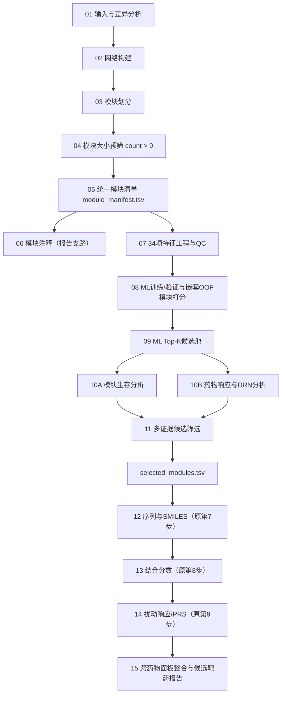

# ML-SnpDR GitHub 仓库与全流程代码规划

## 1. 仓库定位

- GitHub 仓库名：`ML-SnpDR`
- R 包名：`MLSnpDR`（R 包名不使用连字符）
- 参考上游：[`LilyYNY/subnetDR`](https://github.com/LilyYNY/subnetDR)
- 核心扩展：在 subnetDR 的模块大小预筛之后，加入模块特征工程、机器学习亚型打分、模块生存分析、药物响应证据汇总和候选模块筛选；只有最终入选模块才能进入原 subnetDR 的第 7、8、9 步。
- 研究边界：机器学习分数表示“亚型代表性/亚型判别性”，不是直接的药物可成药性或治疗效应。治疗候选必须经过独立的生存、模块规模和药物响应证据层筛选。

subnetDR 当前采用 MIT License。若新仓库直接复制或改写其代码，建议继续采用 MIT License，并在 `LICENSE`、`NOTICE` 和 README 中保留上游版权与修改说明。

## 2. 本地资产盘点结论

当前文件夹已经包含构建 ML-SnpDR 所需的主体资产：

| 资产 | 当前文件/目录 | 可迁移内容 |
|---|---|---|
| 模块划分和大小预筛 | `4、module analysis/ModuleDivision`、`4、module analysis/ModuleSelection` | 3种网络 × 2种模块算法 × 4种亚型的模块及边文件 |
| 34项模块特征 | `6、module feature analysis and ML/calculate_all_module_core_features.py`、`select_core_feature_set.py` | 表达/GSFM、拓扑、突变、TF调控、跨来源稳定性特征 |
| ML训练和OOF打分 | `6、module feature analysis and ML/run_core34_hyperopt_model_inner3_outer5×5.py` | 3折内层调参、5折×5次外层嵌套OOF、模型比较、模块概率 |
| ML整理版 | `6、module feature analysis and ML/ml_clinical_M10_top10_triage_0514` | 模型参数、性能、全模块分数、C3 Top10与临床分诊表 |
| 模块生存 | `6、module feature analysis and ML/module_survival_raw_mean_score_all/run_raw_mean_module_survival_all.R` | 连续Cox、最优截点KM、BH校正、方向判定 |
| 药物响应 | `5、drug response/DrugResponse*` | GDSC1、GDSC2、CTRP2、PRISM的预测、DRN及汇总结果 |
| 序列/SMILES、结合预测、PRS | subnetDR `R/7.SEQCre.R`、`R/8.BindingScore.R`、`R/9.PScore.R`及本地`7、PRS` | 最终模块的药物-靶点下游评分 |

当前核心数据规模为208个模块：C1 63个、C2 44个、C3 49个、C4 52个；来源分布为 String-Louvain 33、String-WF 42、physicalPPIN-Louvain 42、physicalPPIN-WF 20、chengF-Louvain 53、chengF-WF 18。

## 3. 推荐总流程



模块注释可以与特征工程并行，不作为机器学习或临床筛选的硬门槛。第10A/10B步默认只分析ML Top-K模块以节省计算；论文完整复现模式可以设置为分析全部208个预筛模块。

## 4. 推荐仓库结构

```text
ML-SnpDR/
├─ DESCRIPTION
├─ NAMESPACE
├─ LICENSE
├─ NOTICE
├─ README.md
├─ NEWS.md
├─ CITATION.cff
├─ pyproject.toml
├─ environment.yml
├─ renv.lock
├─ _targets.R
├─ config/
│  ├─ default.yml
│  ├─ paper_luad.yml
│  └─ schema.yml
├─ R/
│  ├─ config.R
│  ├─ identifiers.R
│  ├─ io_contracts.R
│  ├─ 01_diff_expression.R
│  ├─ 02_network_construction.R
│  ├─ 03_module_detection.R
│  ├─ 04_module_prefilter.R
│  ├─ 05_module_manifest.R
│  ├─ 06_module_annotation.R
│  ├─ 07_module_features.R
│  ├─ 08_ml_scoring.R
│  ├─ 09_module_survival.R
│  ├─ 10_drug_response.R
│  ├─ 11_candidate_selection.R
│  ├─ 12_seq_smiles.R
│  ├─ 13_binding_affinity.R
│  ├─ 14_perturbation_score.R
│  ├─ 15_candidate_integration.R
│  └─ run_pipeline.R
├─ inst/python/mlsnpdr/
│  ├─ __init__.py
│  ├─ cli.py
│  ├─ features/
│  │  ├─ assemble.py
│  │  ├─ expression.py
│  │  ├─ topology.py
│  │  ├─ mutation.py
│  │  ├─ tf_regulation.py
│  │  └─ stability.py
│  ├─ ml/
│  │  ├─ train.py
│  │  ├─ evaluate.py
│  │  ├─ score.py
│  │  ├─ schema.py
│  │  └─ explain.py
│  ├─ seq_smiles/
│  │  ├─ fetch.py
│  │  └─ cache.py
│  ├─ binding/
│  │  └─ deeppurpose.py
│  └─ enm/
│     ├─ Enm.py
│     └─ support_modules.py
├─ models/
│  ├─ core34_gradient_boosting.joblib
│  ├─ feature_schema.json
│  ├─ class_labels.json
│  └─ model_card.md
├─ data-raw/
│  ├─ README.md
│  └─ download_reference_data.R
├─ inst/extdata/example/
│  ├─ subtype.tsv
│  ├─ expression.tsv
│  ├─ clinical.tsv
│  └─ small_network.tsv
├─ schemas/
│  ├─ module_manifest.schema.json
│  ├─ ml_scores.schema.json
│  ├─ survival_summary.schema.json
│  ├─ drug_response_summary.schema.json
│  └─ selected_modules.schema.json
├─ tests/testthat/
│  ├─ test-identifiers.R
│  ├─ test-manifest.R
│  ├─ test-selection.R
│  ├─ test-selected-only-downstream.R
│  ├─ test-binding-direction.R
│  └─ test-paper-regression.R
├─ vignettes/
│  ├─ full-workflow.Rmd
│  ├─ paper-reproduction.Rmd
│  └─ custom-cohort.Rmd
└─ .github/workflows/
   ├─ R-CMD-check.yaml
   ├─ python-tests.yaml
   └─ example-pipeline.yaml
```

`_targets.R`负责可恢复、可缓存的流水线执行；对普通用户仍提供一个入口函数：

```r
run_ml_snpdr_pipeline(config = "config/paper_luad.yml")
```

## 5. 统一模块标识与文件契约

### 5.1 统一模块标识

所有步骤禁止再依靠目录层级或文件名拆分模块身份。建议使用：

```text
module_uid = <network_slug>__<method_slug>__<subtype>__<module>
示例：physicalppin__louvain__C3__M10
```

同时保留显示字段：`network`、`method`、`subtype`、`module`以及兼容旧表的`legacy_module_id = physicalPPIN|Louvain|C3|M10`。网络和算法名称由受控字典统一，解决 `String/string`、`physicalPPIN/PhysicalPPIN/physicalppin` 等大小写差异。

### 5.2 `module_manifest.tsv`

每行一个模块，至少包含：

```text
module_uid, legacy_module_id, network, method, subtype, module,
module_size, node_file, edge_file,
prefilter_pass, prefilter_reason,
node_sha256, edge_sha256
```

这是后续所有模块级分析的唯一入口。每个函数只接收manifest或manifest的筛选子集，不再递归扫描整个结果目录。

### 5.3 证据主表 `module_evidence.tsv`

在manifest上按`module_uid`合并：

```text
ML：predicted_subtype, prob_C1, prob_C2, prob_C3, prob_C4,
    target_subtype_probability, probability_margin, rank_in_subtype, ml_gate

生存：n_samples, n_events, matched_gene_fraction,
      cox_hr_per_sd, cox_p, cox_fdr,
      cutpoint, logrank_p, logrank_fdr,
      hr_high_vs_low, survival_direction, prognosis_gate

药物：drug_panel, drug_number, tested_drug_number,
      drug_response_density, drn_edge_number,
      drug_p_adjust_method, drug_gate

筛选：size_gate, eligible_after_prognosis_size,
      final_selected, selection_rank, selection_reason
```

### 5.4 `selected_modules.tsv`

只保留最终入选模块，并补齐下游文件位置：

```text
module_uid, network, method, subtype, module, module_size,
primary_drug_panel, drn_file, drn_info_file,
node_file, edge_file, selection_rank, selection_reason
```

原第7/8/9步只能读取该文件，不允许自行重新发现模块。

## 6. 各阶段函数和输出

| 阶段 | 建议主函数 | 输入 | 核心输出 |
|---|---|---|---|
| 04 模块预筛 | `prefilter_modules()` | ModuleDivision节点/边 | 大小`>9`的模块 |
| 05 清单 | `build_module_manifest()` | 预筛结果 | `module_manifest.tsv`及QC |
| 07 特征 | `compute_module_features()` | manifest、表达、ssGSEA、拓扑、突变、TF数据库 | 34项特征矩阵、覆盖率QC、特征字典 |
| 08 ML训练 | `train_module_classifier()` | 34项特征和真实亚型 | 嵌套CV指标、最终模型、模型卡 |
| 08 ML打分 | `score_modules_oof()`/`score_new_modules()` | 特征矩阵 | OOF概率或新样本推理概率 |
| 09 生存 | `analyze_module_survival()` | manifest子集、表达、生存资料 | 连续Cox、KM、BH-FDR、方向 |
| 10 药物响应 | `analyze_drug_response()` | manifest子集、表达、药敏训练集 | 药物预测、显著药物汇总、DRN |
| 11 筛选 | `select_candidate_modules()` | ML、生存、药物汇总 | 全部筛选轨迹、入选manifest |
| 12 原第7步 | `fetch_selected_sequences_smiles()` | selected manifest与DRN | 仅入选模块的序列/SMILES |
| 13 原第8步 | `predict_selected_binding_affinity()` | selected manifest、序列/SMILES | 入选药物-靶点结合预测 |
| 14 原第9步 | `score_selected_perturbations()` | selected manifest、模块PPI、结合预测 | 入选模块的PRS/扰动分数 |

## 7. ML层设计

### 7.1 特征集

固定为版本化的`core34_v1`，包括：

- 7项GSFM/表达特征；
- 12项网络拓扑特征；
- 6项突变特征；
- 5项TF/调控特征；
- 4项跨来源稳定性特征。

`feature_schema.json`必须记录特征顺序、数据类型、缺失值策略、标准化规则和代码版本。`Network`、`Method`、`module_id`、`module_label`只作为身份字段，不进入模型。

### 7.2 训练与打分分离

当前脚本将模型比较、嵌套CV、最终训练、解释和模块打分写在一个文件中，且没有保存最终模型。新仓库应拆为：

1. `train.py`：候选模型调参及最终模型拟合；
2. `evaluate.py`：5折×5次外层、3折内层嵌套CV，主指标为macro OvR AUC；
3. `score.py`：
   - 对论文中的208个训练模块使用嵌套OOF平均概率排序；
   - 对外部新模块使用保存的全数据最终模型推理；
4. `explain.py`：SHAP、置换重要性和交互分析，不阻断主流程。

必须明确区分`oof_probability`和`fitted_model_probability`，禁止在同一列中混用。

### 7.3 当前回归基线

- 选择模型：GradientBoosting；
- 嵌套OOF pooled AUC：约0.9071；
- 固定holdout AUC：约0.8729；
- C3 M10的OOF `prob_C3 = 0.9775395482`，C3内排名第10；
- 跨Network×Method留一验证明显较弱，模型卡必须报告这一限制。

当前结果中“最终全数据调参参数”和“固定holdout使用参数”不是同一组，新仓库必须分别命名并保存，不能统称为`final params`。

## 8. 候选模块筛选标准

### 8.1 论文复现模式（`paper_luad.yml`）

按每个目标亚型独立执行：

1. **模块大小预筛**：`module_size > 9`；
2. **ML候选池**：按目标亚型的嵌套OOF概率降序取Top 10，并要求`predicted_subtype == target_subtype`；
3. **预后方向**：保留`High_score_worse`；
4. **预后显著性**：保留最优截点log-rank `P < 0.05`；
5. **模块稳定规模**：保留`module_size >= 30`；
6. **药物证据**：当前论文复现以PRISM为主面板，按`drug_number`降序、`drug_response_density = drug_number / module_size`降序排序；
7. **最终数量**：每个目标亚型默认选择1个模块；并列时依次比较目标亚型OOF概率、log-rank P和`module_uid`，保证结果确定。

该模式必须同时输出`stepwise_filtering.tsv`，记录每一步留下多少模块、排除原因和完整候选列表。

### 8.2 C3现有结果的回归检查

```text
C3 ML Top10
→ High-score-worse 且 log-rank P<0.05：String-WF-M8、physicalPPIN-Louvain-M7、M10
→ module_size>=30：physicalPPIN-Louvain-M7、M10
→ PRISM药物证据：M10入选
```

M10的当前证据：模块大小53、PRISM显著药物数33、药物响应密度0.6226415、log-rank P=0.0252874、HR(high vs low)=1.76117、BH-FDR=0.0515664。

因此论文表述应是“C3 ML Top10中经临床转化筛选后优先的模块”，不能表述为“ML排名第一模块”。

### 8.3 统计敏感性模式

论文复现规则保留名义P值，以确保与现有M10选择一致；但仓库还应提供不覆盖原结果的敏感性分析：

- `optimal_logrank_FDR < 0.10`；
- 连续Cox HR/1SD及95%CI；
- 中位数截点或预注册固定截点；
- 药物检验使用BH校正并报告效应方向；
- 多药物面板支持数、药物数中位数和密度中位数。

敏感性分析结果必须与论文复现选择分列保存，不能静默替换主结果。

## 9. 建议配置文件

```yaml
project:
  name: ML-SnpDR-LUAD
  seed: 20260513
  target_subtypes: [C3]
  mode: paper_reproduction

module_prefilter:
  min_size_exclusive: 9

ml:
  feature_set: core34_v1
  ranking_score: nested_oof_target_subtype_probability
  top_k_per_subtype: 10
  require_predicted_subtype_match: true
  probability_min: null
  margin_min: null

survival:
  score_method: raw_mean_expression
  endpoint: OS
  cutpoint_method: surv_cutpoint
  min_group_fraction: 0.10
  required_direction: High_score_worse
  logrank_p_max: 0.05
  logrank_fdr_max: null
  report_continuous_cox: true

candidate_selection:
  min_module_size: 30
  primary_drug_panel: PRISM
  sort_by:
    - drug_number: desc
    - drug_response_density: desc
    - target_subtype_probability: desc
  select_n_per_subtype: 1

drug_response:
  panels: [PRISM, GDSC1, GDSC2, CTRP2]
  analysis_scope: all_prefiltered  # fast模式可改为ml_top_k
  significance_metric: wilcoxon_p
  significance_cutoff: 0.05
  p_adjust_method: none            # 论文复现；敏感性模式改为BH

post_selection:
  run_original_steps: [7, 8, 9]
  selected_only: true
```

## 10. 原第7/8/9步的改造要求

### 10.1 原第7步：序列和SMILES

- 输入从“递归扫描所有`DRN_info_*.txt`”改为`selected_modules.tsv`；
- 只处理入选模块及指定药物面板；
- R包装器使用`system.file("python", ..., package="MLSnpDR")`，移除`F:/sample_test/...`硬编码；
- UniProt和PubChem请求加入重试、超时、速率限制、失败清单与SQLite缓存；
- 输出增加`fetch_status`、`source_database`、`retrieved_at`和`source_id`。

### 10.2 原第8步：结合分数

- 只读取selected manifest中列出的DRN、序列和SMILES；
- DeepPurpose模型名称、设备、批大小和权重缓存目录进入配置；
- 输出明确记录模型名称、权重版本、软件版本和分数方向；
- 保留“较低Binding Score更优”的排序定义，并新增归一化的`affinity_strength`字段。

### 10.3 原第9步：扰动响应/PRS

- `split_edge_module()`不再拆分全部模块，只从selected manifest精确提取对应模块边；
- 移除`F:\\sample_test\\python`硬编码；
- 用`module_uid`连接结合预测、节点敏感性和PPI边；
- 每个入选模块产生独立结果，并在总表中保留药物面板字段。

### 10.4 必须处理的分数方向问题

原第8步按Binding Score升序，说明低分更优；原第9步却计算`Binding.Score × sens`并降序，可能把较差结合分数排在前面。新仓库不得继续隐式使用这一冲突逻辑。

建议同时输出：

- `legacy_ps = binding_score * sensitivity`：仅用于复现旧结果并清楚标注；
- `affinity_strength = 1 - percentile_rank(binding_score)`；
- `sensitivity_strength = percentile_rank(sensitivity)`；
- `direction_corrected_ps = affinity_strength * sensitivity_strength`：用于方向一致的新分析。

在正式发布候选排名前，需要用已知DTI或外部药敏数据决定主排序使用哪一个分数；两种分数不能混为一个`ps`列。

## 11. 当前代码必须重构的问题

1. 多处绝对路径和本机Python环境路径硬编码；
2. 第7/8/9步通过目录扫描和固定层级推断模块身份，容易误读历史结果；
3. 网络名称大小写不统一，模块连接依赖临时标准化；
4. ML训练、评估、打分、解释耦合在单个1285行脚本中，且未保存最终拟合模型；
5. 最终全数据参数与holdout模型参数容易被混淆；
6. 生存最优截点会带来乐观偏倚，名义log-rank P必须与BH-FDR同时报告；
7. 当前药物显著数基于未校正Wilcoxon P<0.05，缺少效应方向与多重检验标记；
8. DeepPurpose结合分数与PRS综合分数方向存在冲突；
9. 当前`split_edge_module()`只向已存在的目录写文件，会造成模块缺失取决于旧目录状态；
10. 原始数据、模型权重、网络数据库和API返回缺少版本/校验和记录。

## 12. 测试与验收标准

### 12.1 数据契约测试

- `module_uid`唯一且与4个身份字段可逆；
- 节点/边文件存在且校验和一致；
- 34项特征顺序固定、均为数值、缺失策略可追踪；
- 证据表与manifest一对一连接，无静默丢失模块；
- 每个排除模块都有`selection_reason`。

### 12.2 论文结果回归测试

- 预筛后共208个模块，亚型计数为63/44/49/52；
- GradientBoosting嵌套OOF AUC在锁定环境下复现至预设容差；
- C3 Top10顺序与冻结结果一致；
- M10为C3第10名，`prob_C3`约0.97754；
- M10生存、模块大小和PRISM药物证据与冻结表一致；
- `selected_modules.tsv`在C3论文模式中只包含`physicalppin__louvain__C3__M10`。

### 12.3 selected-only下游测试

- 第7/8/9步创建的模块目录集合必须与selected manifest完全相等；
- 未入选模块不得生成序列、结合预测或PRS新结果；
- 缺少序列、SMILES或PPI边时输出结构化失败记录，不得静默跳过；
- 结合分数和扰动分数方向测试必须用一个可人工计算的小型示例通过。

## 13. 数据与发布策略

- GitHub只提交代码、配置、数据schema、最小示例和小型冻结回归表；
- 不提交患者级原始表达和临床数据；公开仓库中仅提供下载/预处理脚本和数据来源说明；
- GDSC、PRISM、CTRP、STRING等数据需逐项记录许可、版本、下载日期和URL；
- DeepPurpose权重和大型中间结果由下载脚本或GitHub Release提供，并记录SHA256；
- `results/`默认加入`.gitignore`，只在`inst/extdata/paper_snapshot/`保留用于验收的小型汇总表；
- 在`CITATION.cff`中同时引用ML-SnpDR论文、subnetDR及关键外部方法。

## 14. 实施顺序

### P0：冻结现有结果和字段（最高优先级）

- 冻结208模块manifest、34特征表、OOF概率、生存汇总、PRISM药物汇总和M10最终筛选表；
- 给每个冻结文件生成SHA256；
- 写出字段字典和受控网络/算法名称。

### P1：建立包骨架和统一配置

- 从subnetDR复制/重命名上游R函数并保留许可证头；
- 建立`config.yml`、路径解析、日志、随机种子和版本记录；
- 移除所有绝对路径。

### P2：manifest和34项特征模块化

- 先实现`module_manifest.tsv`；
- 将800行特征脚本拆为5个特征块和一个组装器；
- 加入覆盖率QC和schema验证。

### P3：ML训练、评估和打分拆分

- 保存最终模型和特征schema；
- 固化OOF评分流程；
- 输出模型卡和跨来源验证限制。

### P4：生存、药物响应和筛选闸门

- 将生存脚本参数化；
- 把药物汇总从notebook迁移为正式函数；
- 实现论文复现模式与敏感性模式；
- 生成`module_evidence.tsv`、`stepwise_filtering.tsv`和`selected_modules.tsv`。

### P5：改造原第7/8/9步

- 全部改为selected manifest驱动；
- 加入API缓存、失败重试、模型版本和selected-only断言；
- 同时输出legacy与方向修正后的PRS。

### P6：示例、CI和发布

- 建立小型端到端example；
- 添加R/Python单元测试和GitHub Actions；
- 完成README、vignette、模型卡、数据来源及引用信息；
- 先发布`v0.1.0-paper-reproduction`，再增加通用外部队列模式。

## 15. README建议结构

1. 一句话说明ML-SnpDR解决什么问题；
2. 全流程图；
3. 与subnetDR相比新增的步骤；
4. 安装R与Python环境；
5. 5分钟小型示例；
6. LUAD论文复现命令；
7. 输入输出schema；
8. 模块筛选标准；
9. 分数方向与统计解释；
10. 数据来源、许可和引用；
11. 常见错误与缓存清理方法。

## 16. 最终代码入口示例

```r
library(MLSnpDR)

result <- run_ml_snpdr_pipeline("config/paper_luad.yml")

result$selected_modules
# module_uid                              subtype  selection_rank
# physicalppin__louvain__C3__M10          C3       1
```

也应允许只运行候选筛选之后的原第7/8/9步：

```r
run_selected_module_drug_pipeline(
  selected_manifest = "results/selection/selected_modules.tsv",
  steps = c("seq_smiles", "binding", "perturbation")
)
```

该入口必须在执行前打印将处理的模块清单，并在结束后验证实际产生结果的模块集合与manifest一致。
