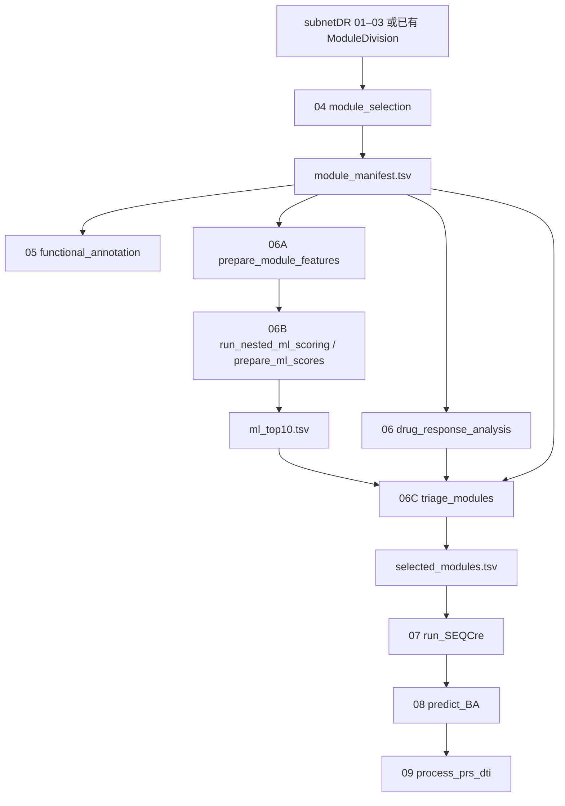

# ML-SnpDR 流程架构

## 1. 设计目标

ML-SnpDR 不是一条与 subnetDR 平行的新流程，而是在原第 6 步和第 7 步之间插入机器学习与临床证据筛选链。每一步都满足以下约束：

1. 可以单独调用，并由参数显式指定输入和输出。
2. 主输出可以直接作为下一依赖步骤的主输入。
3. 所有模块级表以 `module_uid` 一对一连接。
4. 输入覆盖、身份、列类型和文件存在性均在计算前校验。
5. 第 4–6B 步处理全部大小预筛模块；第 6C 步建立唯一边界；第 7–9 步只处理入选模块。
6. 不使用 `setwd()`，不硬编码盘符，不靠递归目录扫描推断模块身份。

## 2. 执行图

第 5 步提供解释和报告结果，不改变进入特征工程的模块全集。第 6 步同样不能按药物响应预先删除模块，否则会对机器学习后的证据比较造成选择偏倚。

## 3. 阶段注册表

| 编号 | 实现 | 范围 | 主输出 |
|---|---|---|---|
| 01 | 外部/subnetDR | 队列 | 差异表达结果 |
| 02 | 外部/subnetDR | 亚型 | 网络结果 |
| 03 | 外部/subnetDR | 亚型×网络×算法 | ModuleDivision 文件 |
| 04 | `module_selection()` | 全部大小预筛模块 | `module_manifest.tsv` |
| 05 | `functional_annotation()` | manifest 全部模块 | `module_annotation.tsv` |
| 06 | `drug_response_analysis()` | manifest 全部模块×面板 | `drug_response_summary.tsv`、DRN |
| 06A | `prepare_module_features()` | manifest 全部模块 | `module_features.tsv` |
| 06B | `run_nested_ml_scoring()` / `prepare_ml_scores()` | manifest 全部模块 | `ml_scores.tsv`、`ml_top10.tsv` |
| 06C | `triage_modules()` | 每亚型 ML Top10 | `selected_modules.tsv` |
| 07 | `run_SEQCre()` | 每亚型最优模块 | `seq_smiles_manifest.tsv` |
| 08 | `predict_BA()` | 每亚型最优模块 | `binding_scores.tsv` |
| 09 | `process_prs_dti()` | 每亚型最优模块 | `final_candidates.tsv` |

实际顺序由 `mlsnpdr_stage_registry()` 返回。`run_ML_SnpDR()` 选择注册表中的连续区间，`run_ml_snpdr_pipeline()` 负责读取配置和传递实际输出路径。

## 4. 两个数据边界

### 4.1 全模块边界

`module_manifest.tsv` 是第 4–6A 步共享的唯一模块全集。它包含：

- 标准身份：network、method、subtype、module、`module_uid`；
- 模块规模和内部边数；
- 每模块 node/edge 文件相对路径；
- 源文件、SHA256 和预筛状态。

第 5、6、6A 步均从同一份 manifest 读取模块，禁止分别扫描目录生成不同全集。

### 4.2 入选模块边界

`selected_modules.tsv` 是第 7–9 步唯一允许的模块集合。第 6C 步将每个入选模块的 node、edge、DRN 和 DRN-info 文件复制到自己的输出目录，并在表中记录相对路径。

第 7–9 步的安全要求：

- 所有输入 `module_uid` 必须属于 selected 集合；
- 不允许出现 selected 之外的预测或敏感性记录；
- 不允许从文件夹名称重新推断模块；
- strict 模式下缺失路径或查找项立即报错。

## 5. 机器学习和筛选语义

### 5.1 第 6A 步

`prepare_module_features()` 是特征契约适配器。它把既有 Core34 表映射到 manifest，固定 34 个数值特征的顺序，并输出来源哈希、特征 schema 和 QC。身份列和 `module_size` 不作为模型特征。

### 5.2 第 6B 步

有两种受支持路径：

- `run_nested_ml_scoring()`：调用仓库内 Python 脚本执行重复嵌套 OOF Gradient Boosting；
- `prepare_ml_scores()`：导入外部已计算的 C1–C4 概率并执行同一套覆盖、概率、排名和 Top-K 校验。

两者最终都产生一行一个模块的 `ml_scores.tsv`，以及每亚型受控 Top-K 的 `ml_top10.tsv`。

### 5.3 第 6C 步

`triage_modules()` 只读取 ML Top10，并与预计算模块生存结果和第 6 步主药敏面板汇总连接。默认规则是：

1. 通过 ML gate；
2. `High_score_worse` 且 log-rank P ≤ 0.05；
3. `module_size >= 30`；
4. 存在 PRISM 结果；
5. 依次按显著药物数、药物响应密度、目标亚型概率降序；
6. 每亚型取 1 个模块。

完整过程写入 `module_filtering_stepwise.tsv`，不是只保留最终结论。

## 6. 第 7–9 步的改造

原 subnetDR 实现会递归扫描所有 DRN/ModuleDivision 文件。ML-SnpDR 改为显式传递：

- `run_SEQCre(selected_modules.tsv, ...)`：从入选 DRN-info 提取实际蛋白和药物；
- `predict_BA(selected_modules.tsv, seq_smiles_manifest.tsv, ...)`：只构造入选模块的 DPI；
- `process_prs_dti(selected_modules.tsv, binding_scores.tsv, ...)`：只对入选模块计算敏感性和扰动分数。

外部序列查询、结合模型和 ENM/PRS 工具可以先独立运行，再通过标准表导入；也可通过函数回调接入。这样把文件契约与具体第三方工具解耦，同时维持 7→8→9 的连续数据流。

## 7. 复现与防误用

- YAML 保存随机种子、面板、阈值、特征版本、CV 参数和输出目录。
- `dry_run = TRUE` 只校验配置并返回执行计划，不运行科学计算。
- 输出目录通过临时目录完成后原子重命名；已存在的目标目录不会被静默覆盖。
- Core34 来源、manifest 和概率表记录 SHA256 或来源路径。
- Python 模型保存 fold 结果、元数据和 `fitted_model.joblib`。
- 第 1–3 步当前标记为未在本包实现，完整运行默认从 `module_selection` 开始。

所有输入输出列定义见 [io-contracts.md](io-contracts.md)。
