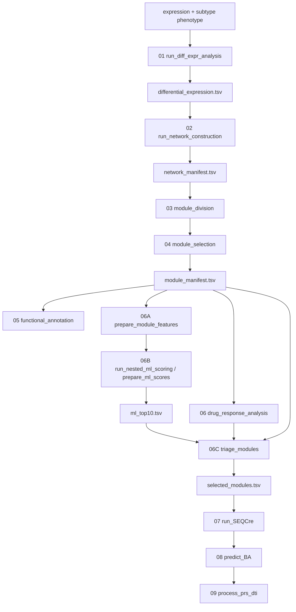

# ML-SnpDR Pipeline Architecture

## 1. Design goals

ML-SnpDR is not a separate workflow running in parallel with subnetDR. It inserts a machine-learning and clinical-evidence triage chain between the original steps 6 and 7. Every stage follows these constraints:

1. It can be called independently, with inputs and outputs specified explicitly through function arguments.
2. Its primary output can be used directly as the primary input to the next dependent stage.
3. All module-level tables are joined one-to-one by `module_uid`.
4. Input coverage, identity, column types, and file existence are validated before computation.
5. Steps 4–6B process all size-prefiltered modules; step 6C establishes the single selection boundary; steps 7–9 process selected modules only.
6. The workflow does not use `setwd()`, hard-code drive letters, or infer module identity through recursive directory scans.

## 2. Execution graph

Step 5 provides interpretation and reporting outputs but does not alter the complete module set entering feature preparation. Step 6 likewise cannot remove modules on the basis of drug response before ML scoring, because doing so would introduce selection bias into post-ML evidence comparisons.

## 3. Stage registry

| Number | Implementation | Scope | Primary output |
|---|---|---|---|
| 01 | `run_diff_expr_analysis()` | Cohort; each subtype vs all other samples | `differential_expression.tsv` |
| 02 | `run_network_construction()` | Subtype × network | `network_manifest.tsv`, PPI edge tables |
| 03 | `module_division()` / `subtype_module()` | Subtype × network × algorithm | `module_division_manifest.tsv` |
| 04 | `module_selection()` | All size-prefiltered modules | `module_manifest.tsv` |
| 05 | `functional_annotation()` | All modules in the manifest | `module_annotation.tsv` |
| 06 | `drug_response_analysis()` | All manifest modules × panels | `drug_response_summary.tsv`, DRNs |
| 06A | `prepare_module_features()` | All manifest modules | `module_features.tsv` |
| 06B | `run_nested_ml_scoring()` / `prepare_ml_scores()` | All manifest modules | `ml_scores.tsv`, `ml_top10.tsv` |
| 06C | `triage_modules()` | ML top 10 for each subtype | `selected_modules.tsv` |
| 07 | `run_SEQCre()` | Optimal module from each subtype | `seq_smiles_manifest.tsv` |
| 08 | `predict_BA()` | Optimal module from each subtype | `binding_scores.tsv` |
| 09 | `process_prs_dti()` | Optimal module from each subtype | `final_candidates.tsv` |

The actual order is returned by `mlsnpdr_stage_registry()`. `run_ML_SnpDR()` selects a contiguous interval from the registry, while `run_ml_snpdr_pipeline()` reads the configuration and propagates actual output paths between stages.

## 4. Data boundaries

Steps 1–4 establish three consecutive upstream contracts: `differential_expression.tsv` fixes the semantics of subtype-specific differential proteins; `network_manifest.tsv` fixes the identity of subtype PPI files; and `module_division_manifest.tsv` fixes every subtype-network-algorithm combination and its node/edge module files. The top-level runner propagates returned paths instead of rescanning directories or guessing upstream outputs.

### 4.1 All-module boundary

`module_manifest.tsv` is the single module universe shared by steps 4–6A. It contains:

- Canonical identity: network, method, subtype, module, and `module_uid`.
- Module size and internal-edge count.
- Relative paths to per-module node and edge files.
- Source files, SHA256 checksums, and prefilter status.

Steps 5, 6, and 6A all read modules from the same manifest. They must not scan directories independently and construct different module universes.

### 4.2 Selected-module boundary

`selected_modules.tsv` is the only permitted module set for steps 7–9. Step 6C copies the node, edge, DRN, and DRN-info files for every selected module into its output directory and records their relative paths in the table.

Safety requirements for steps 7–9:

- Every input `module_uid` must belong to the selected set.
- Prediction or sensitivity records outside the selected set are not permitted.
- Module identity must not be inferred from folder names.
- In strict mode, missing paths or lookup entries raise an error immediately.

## 5. Machine-learning and triage semantics

### 5.1 Step 6A

`prepare_module_features()` is a feature-contract adapter. It maps an existing Core34 table to the manifest, fixes the order of the 34 numeric features, and writes source hashes, a feature schema, and QC results. Identity columns and `module_size` are not model features unless `module_size` is explicitly declared as part of Core34.

### 5.2 Step 6B

Two execution paths are supported:

- `run_nested_ml_scoring()`: calls the repository's Python implementation of repeated nested OOF Gradient Boosting.
- `prepare_ml_scores()`: imports externally calculated C1–C4 probabilities and applies the same coverage, probability, ranking, and Top-K validation.

Both paths produce `ml_scores.tsv` with one row per module and a controlled per-subtype Top-K table, `ml_top10.tsv` when `top_k=10`.

### 5.3 Step 6C

`triage_modules()` reads only the ML top 10 and joins them with precomputed module-survival results and the primary step-6 drug-sensitivity-panel summary. The default rules are:

1. Pass the ML gate.
2. Meet `High_score_worse` with log-rank P ≤ 0.05.
3. Meet `module_size >= 30`.
4. Have a PRISM result.
5. Sort by significant-drug count, drug-response density, and target-subtype probability, all in descending order.
6. Select one module per subtype.

The complete process is written to `module_filtering_stepwise.tsv`, rather than retaining only the final decision.

## 6. Adaptation of steps 7–9

The original subnetDR implementation recursively scans all DRN/ModuleDivision files. ML-SnpDR replaces this behavior with explicit data propagation:

- `run_SEQCre(selected_modules.tsv, ...)`: extracts observed proteins and drugs from selected DRN-info files.
- `predict_BA(selected_modules.tsv, seq_smiles_manifest.tsv, ...)`: constructs DPIs for selected modules only.
- `process_prs_dti(selected_modules.tsv, binding_scores.tsv, ...)`: calculates sensitivity and perturbation scores for selected modules only.

External sequence-query, binding, and ENM/PRS tools can run independently and import results through canonical tables, or they can be integrated through function callbacks. This separates file contracts from specific third-party tools while preserving the continuous 7 → 8 → 9 data flow.

## 7. Reproducibility and misuse prevention

- YAML records random seeds, panels, thresholds, feature versions, CV parameters, and output directories.
- `dry_run = TRUE` validates the configuration and returns an execution plan without scientific computation.
- Output directories are completed in temporary locations and atomically renamed; existing target directories are not silently overwritten.
- Core34 sources, manifests, and probability tables record SHA256 checksums or source paths.
- The Python model stores fold results, metadata, and `fitted_model.joblib`.
- Steps 1–3 and 4–9 are implemented in this package, and complete runs start from `deps` by default.

See [io-contracts.md](io-contracts.md) for all input and output column definitions.
